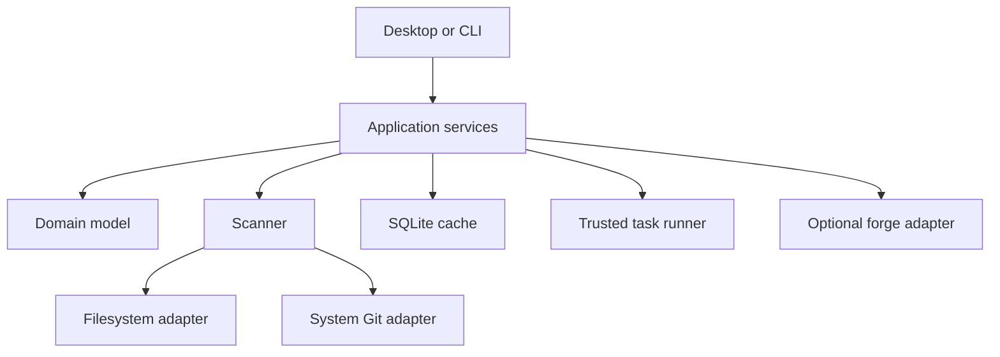

# System architecture

## Context

gradar is a single-user desktop application with a companion CLI. It reads local
filesystem and Git state, maintains a disposable cache, optionally queries a
remote forge adapter, and launches explicitly configured local actions.

No central service is required. The application must remain useful offline.

## Planned structure

```text
gradar/
├── apps/
│   ├── desktop/          # Tauri shell and Svelte interface
│   └── cli/              # Scriptable commands and JSON output
├── crates/
│   ├── domain/           # Pure types, policies and classifications
│   ├── scanner/          # Discovery orchestration and bounded concurrency
│   ├── git-cli/          # Structured adapter over the system Git executable
│   ├── persistence/      # SQLite cache, migrations and repositories
│   ├── tasks/            # Trust, execution and captured evidence
│   ├── forge/            # Forge-neutral interface
│   └── forge-github-gh/  # Optional GitHub adapter through gh
├── fixtures/             # Generated Git topology fixtures
└── docs/
```

The exact crate split should be tested during the scaffold PR. Avoid creating
empty abstraction crates before code needs the boundary.

## Runtime flow



The domain does not import Tauri, SQLite, process APIs or forge-specific types.
Adapters convert external results into explicit domain evidence.

## Core domain types

Names are illustrative until the domain-model PR:

- `RepositoryIdentity`: stable identity derived from the Git common directory.
- `WorktreeSnapshot`: path, head, branch, lock/prunable state and dirty summary.
- `RepositorySnapshot`: worktrees, remotes, branches, activity and scan evidence.
- `Evidence<T>`: value plus source, observed time and freshness.
- `Signal`: explainable attention or workflow condition with severity and reason.
- `TaskDefinition`: trusted executable, arguments, policy and output handling.
- `TaskRun`: definition revision, commit, dirty fingerprint, result and timing.
- `Handover`: deterministic projection of a repository snapshot.
- `Capability`: availability and diagnostic reason for Git, `gh`, launchers and
  platform integrations.

## Discovery

Discovery traverses configured roots with explicit depth, ignore patterns,
filesystem-boundary and symlink policies. It recognises `.git` directories and
`.git` files, then asks Git for canonical common-directory and worktree data.

Requirements:

- cancellation and bounded concurrency;
- deterministic deduplication;
- partial results when individual paths fail;
- no traversal into ignored heavyweight directories;
- no assumption that repository paths are UTF-8;
- scan-generation identifiers so late results cannot overwrite newer state;
- observable duration and error counts without recording private filenames.

## Git adapter

The system `git` executable is authoritative. Commands use argument arrays,
controlled working directories, non-interactive environment settings, timeouts
and captured stdout/stderr limits. Machine-readable formats and NUL delimiters
are preferred.

No command invoked during observation may alter the working tree, index, refs or
configuration. Fetch is an explicit user action and its completion creates new
remote evidence with a timestamp.

## Persistence

SQLite stores derived, rebuildable state:

- known roots and repository identities;
- latest snapshots and observation timestamps;
- pins, groups, saved views and local overrides;
- trusted task decisions and task-run evidence;
- UI preferences and capability results.

Repository contents and full command logs are not indexed. Schema migrations
must be forward-only, transactional and covered by migration tests. The user can
reset the cache without losing exported configuration.

## Concurrency and refresh

- initial discovery produces progressive results;
- cheap local status refreshes are prioritised over disk size and remote calls;
- per-repository work is serialised where operations might interact;
- global concurrency is configurable and bounded;
- refresh requests coalesce;
- UI reads immutable snapshots and never waits synchronously for Git commands;
- application shutdown cancels work and does not orphan child processes.

## Failure model

Missing executables, permission errors, malformed output, timeouts, offline
forges and unusual Git topology are data, not crashes. Each failed capability or
observation records a safe human-readable explanation and diagnostic detail.

## Extensibility boundary

V1 has internal adapters, not a public plugin system. GitHub through `gh` is the
first forge adapter. Forgejo and GitLab can follow without contaminating local
domain types. Configured actions provide a narrow extension surface before a
plugin API is justified.

## Packaging

Initial targets:

1. development on CachyOS/KDE/Wayland;
2. release AppImage;
3. reproducible AUR-friendly source package instructions.

Flatpak is deferred because filesystem traversal and launching host tools need a
carefully designed portal/helper model. Platform adapters must not leak this
constraint into the domain.
