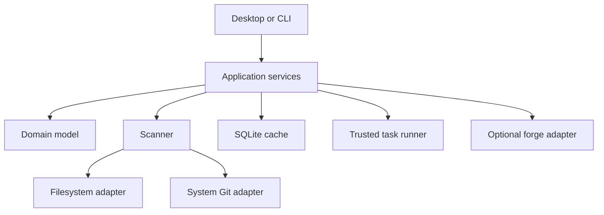

# System architecture

## Context

gweav is a single-user desktop application with a companion CLI. It reads local
filesystem and Git state, maintains a disposable cache, optionally queries a
remote forge adapter, and launches explicitly configured local actions.

No central service is required. The application must remain useful offline.

## Starting structure

The workspace **starts** with three crates and grows only when a boundary is
actually violated:

```text
gweav/
├── apps/
│   ├── desktop/          # Tauri shell and Svelte interface
│   └── cli/              # Scriptable commands and JSON output
├── crates/
│   └── core/             # Domain, scanner, Git adapter, persistence, tasks
├── fixtures/             # Generated Git topology fixtures
└── docs/
```

Inside `core`, the same separation applies at module level: `domain` must not
reference process, SQL, Tauri or forge types, and a compile-time or test-time
check should enforce that. Module boundaries are cheap to move; crate boundaries
are not.

## Planned extractions

These are the expected future crates, listed so that module names anticipate
them. **Do not create them until code needs the boundary** — an issue's
acceptance criteria may not be met by adding an empty or single-type crate.

| Future crate | Extract when |
| --- | --- |
| `domain` | The dependency check needs to be structural, not conventional |
| `git-cli` | A second consumer needs the adapter without the scanner |
| `scanner` | Scheduling policy changes independently of adapters |
| `persistence` | Migrations need their own test and release cadence |
| `tasks` | Trust and execution need an isolated review surface |
| `forge` + `forge-github-gh` | A second forge implementation begins |

An extraction is a mechanical, reviewable PR of its own. It is never bundled
with feature work.

## Runtime flow



The domain does not import Tauri, SQLite, process APIs or forge-specific types.
Adapters convert external results into explicit domain evidence.

## Desktop boundary

The Tauri layer is deliberately thin, because it is the one layer that cannot
be exercised in headless CI. It contains command registration, window lifecycle
and platform glue only.

- Application logic lives in Rust and is covered by Rust tests.
- Interface logic lives in Svelte behind a small, mockable command interface,
  and is covered by component and browser tests that run without Tauri.
- Anything only testable by launching the desktop shell is a candidate for
  moving out of the shell.

## Core domain types

Names are illustrative until the domain-model PR:

- `RepositoryIdentity`: stable identity derived from the Git common directory.
- `WorktreeIdentity`: stable identity for one worktree within a repository; the
  primary unit of work (see ADR 0004).
- `WorktreeSnapshot`: path, head, branch, lock/prunable state and dirty summary.
- `RepositorySnapshot`: worktrees, remotes, branches, activity and scan evidence
  — a rollup, not a replacement for worktree state.
- `Evidence<T>`: value plus source, observed time and freshness.
- `Signal`: explainable attention or workflow condition with severity and reason.
- `Provenance`: derived, non-authoritative hint about the origin of work.
- `TaskDefinition`: trusted executable, arguments, policy and output handling.
- `TaskRun`: definition revision, commit, dirty fingerprint, result and timing.
- `Handover`: deterministic projection of a repository or worktree snapshot.
- `Capability`: availability and diagnostic reason for Git, `gh`, launchers and
  platform integrations.

## Discovery

Discovery traverses configured roots with explicit depth, ignore patterns,
filesystem-boundary and symlink policies. It recognises `.git` directories and
`.git` files, then asks Git for canonical common-directory and worktree data.

Requirements:

- cancellation and bounded concurrency;
- deterministic deduplication;
- partial results when individual paths fail;
- no traversal into ignored heavyweight directories;
- no assumption that repository paths are UTF-8;
- scan-generation identifiers so late results cannot overwrite newer state;
- observable duration and error counts without recording private filenames.

## Git adapter

The system `git` executable is authoritative. Commands use argument arrays,
controlled working directories, non-interactive environment settings, timeouts
and captured stdout/stderr limits. Machine-readable formats and NUL delimiters
are preferred.

Observation is not read-only by default: several ordinary Git commands can
execute repository-controlled programs or take locks. Every observation
invocation must therefore use the hardened invocation contract defined in
[ADR 0002](adr/0002-system-git.md) and `docs/SECURITY.md`. This is an
implementation requirement, not a recommendation.

No command invoked during observation may alter the working tree, index, refs or
configuration, or take a lock that could interrupt a concurrent user or agent.
Fetch is an explicit user action and its completion creates new remote evidence
with a timestamp.

## Persistence

SQLite stores derived, rebuildable state:

- known roots, repository identities and worktree identities;
- latest snapshots and observation timestamps;
- pins, groups, saved views and local overrides;
- trusted task decisions and task-run evidence;
- UI preferences and capability results.

Repository contents and full command logs are not indexed. Schema migrations
must be forward-only, transactional and covered by migration tests. The user can
reset the cache without losing exported configuration.

## Concurrency and refresh

- initial discovery produces progressive results;
- cheap local status refreshes are prioritised over disk size and remote calls;
- per-repository work is serialised where operations might interact;
- global concurrency is configurable and bounded;
- refresh requests coalesce;
- UI reads immutable snapshots and never waits synchronously for Git commands;
- application shutdown cancels work and does not orphan child processes.

## Failure model

Missing executables, permission errors, malformed output, timeouts, offline
forges, refused ownership checks and unusual Git topology are data, not crashes.
Each failed capability or observation records a safe human-readable explanation
and diagnostic detail.

## Extensibility boundary

V1 has internal adapters, not a public plugin system. GitHub through `gh` is the
first forge adapter. Forgejo and GitLab can follow without contaminating local
domain types. Configured actions provide a narrow extension surface before a
plugin API is justified.

## Packaging

V1 targets a source-first Arch build path only:

1. development on CachyOS/KDE/Wayland;
2. reproducible AUR-friendly source package instructions.

Portable single-file bundles are post-V1. AppImage and Flatpak both require
solving WebKitGTK bundling or portal-mediated filesystem traversal and host tool
launching, and neither is on the path to a usable V1 for the reference user. See
[ADR 0005](adr/0005-linux-packaging.md).

Platform adapters must not leak packaging constraints into the domain.
